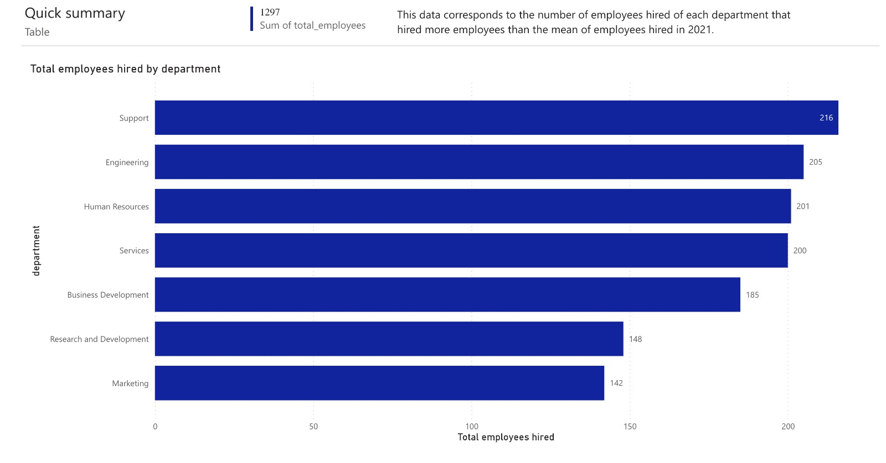
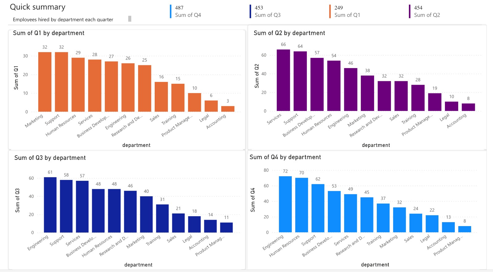

# Data Analysis

This folder contains the necessary files and scripts for data analysis using PowerBI

## Files

- `employees_metrics.csv`: Result of endpoint for employees metrics
- `department_metrics.csv`: Result of endpoint for department metrics

## Visualization results

Description: Visualization of employees metrics

Description: Visualization of department metrics

These are the powerBI links to access each one of the reports:
- [Employees Metrics Report](https://app.powerbi.com/view?r=eyJrIjoiNjRlMDBlZmMtNzg2OS00YTM0LTliN2MtMTZjNmIwYWVmNDU2IiwidCI6Ijk5ZjdiNTVlLTljYmUtNDY3Yi04MTQzLTkxOTc4MjkxOGFmYiIsImMiOjR9)
- [Department Metrics Report](https://app.powerbi.com/view?r=eyJrIjoiMTA4NTU5MzgtMjRmNi00MTc2LThjNTgtMGQyN2Q2ZDk0YWVlIiwidCI6Ijk5ZjdiNTVlLTljYmUtNDY3Yi04MTQzLTkxOTc4MjkxOGFmYiIsImMiOjR9)

